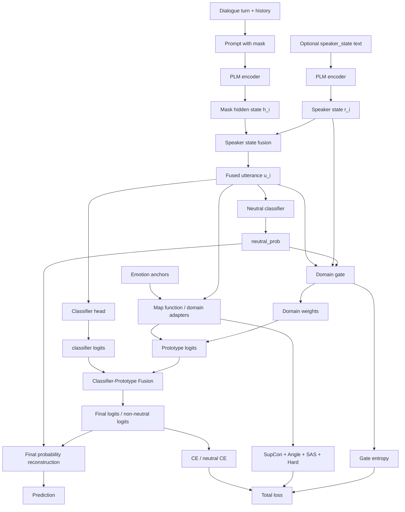

# ERC 当前模型结构报告

## 1. 总览

当前项目是在原始 EACL 框架上继续扩展的 ERC 模型。它的核心思想是：

1. 用预训练语言模型编码对话上下文中的目标话语；
2. 用情感语义 anchor / prototype 作为类别先验；
3. 通过 supervised contrastive learning、anchor separation、hard negative 等辅助目标改善表示空间；
4. 通过 neutral decoupling 单独处理 neutral 类别；
5. 通过 speaker state 与 domain-gated subanchors 引入更细粒度的情感域信息；
6. 最新加入 classifier head + prototype head fusion，用数据驱动分类头和语义原型头共同预测。

当前主要入口文件：

| 模块 | 文件 | 作用 |
|---|---|---|
| 训练入口 | `src/run.py` | 参数解析、数据集加载、训练循环、保存模型和报告 |
| 数据集 | `src/dataset.py` | 将对话样本构造成 prompt 输入 |
| 主模型 | `src/model/model.py` | PLM 编码、anchor 映射、domain gate、neutral branch、fusion |
| 损失函数 | `src/model/loss.py` | CE、SupCon、Angle、SAS、Hard Negative、Gate Entropy |
| 训练器 | `src/trainer/trainer.py` | train/eval loop、梯度裁剪、梯度累积、指标统计 |
| anchor 模板 | `src/model/anchor_utils.py` | emotion label 顺序、anchor prompt、anchor 加载 |
| 后台实验队列 | `scripts/sas_nsg_train_queue.py` | 统一运行 baseline、ablation、targeted、fusion 实验组 |

## 2. 输入数据流

### 2.1 支持的数据集

当前 `src/run.py` 中原生支持：

| 数据集 | 文件格式 | 类别数 |
|---|---:|---:|
| IEMOCAP | `train/dev/test_data.json` | 6 |
| MELD | `train/dev/test_data.csv` | 7 |
| EmoryNLP | `train/dev/test_data.json` | 7 |

数据目录约定：

```text
data/{dataset_name}/train_data.*
data/{dataset_name}/dev_data.*
data/{dataset_name}/test_data.*
data/{dataset_name}/label_vocab.pkl
```

### 2.2 话语 prompt 构造

`DialogueDataset` 会按对话顺序读取每个 turn，并构造目标话语 prompt：

```text
历史上下文 + "For utterance: {text} {speaker} feels <mask>"
```

其中：

- 历史上下文来自当前话语之前的若干 turn；
- `max_len` 默认 256；
- 当前话语情感由 `<mask>` 位置的表示参与后续分类；
- 如果开启 `--use_speaker_state`，每条样本额外返回 speaker state 文本及 attention mask。

### 2.3 speaker state

speaker state 的默认字段为：

```text
mental_state
interaction_relation
expression_style
context_shift
```

如果原始数据没有这些字段，则统一使用 `unknown.`。这保证了开启 speaker state 后，模型不会因为缺字段而中断。

## 3. 编码器结构

主编码器是 HuggingFace `AutoModel`：

```python
self.f_context_encoder = AutoModel.from_pretrained(args.bert_path, local_files_only=True)
```

典型配置使用：

```text
pretrained/sup-simcse-roberta-large
```

输入经过 PLM 后，模型取 `<mask>` 位置 hidden state：

```text
mask_outputs = PLM(input_ids)[mask_position]
```

记作：

```text
h_i in R^d
```

其中 `d` 通常为 1024。

## 4. 情感 Anchor / Prototype

### 4.1 anchor 文件

anchor 由 `src/generate_anchors.py` 生成，保存到：

```text
emo_anchors/{model_name}/{dataset_name_lower}_emo_{num_subanchors}.pt
```

例如：

```text
emo_anchors/sup-simcse-roberta-large/iemocap_emo_4.pt
```

### 4.2 anchor 张量形状

当前模型按多子锚点设计：

```text
emo_anchor: [num_classes, num_subanchors, hidden_dim]
```

在 `domain_gated` 或 `entropy` 模式下，要求：

```text
num_subanchors = 4
```

4 个 subanchors 对应四个情感域：

```text
activation
interaction
expression
context_shift
```

### 4.3 标签顺序

`anchor_utils.py` 中定义了 anchor 的类别顺序。这个顺序必须和 `label_vocab.pkl` 的 id 顺序一致，否则 prototype 语义会错位。

IEMOCAP：

```text
neutral, excited, frustrated, sad, happy, angry
```

MELD：

```text
anger, disgust, fear, joy, sadness, surprise, neutral
```

EmoryNLP：

```text
joyful, neutral, powerful, mad, scared, peaceful, sad
```

## 5. 表示映射模块

模型有两类表示映射。

### 5.1 通用映射 `map_function`

用于普通 prototype matching：

```text
Linear(d, d)
LayerNorm
ReLU
Linear(d, mapping_lower_dim)
```

默认：

```text
mapping_lower_dim = 1024
```

### 5.2 domain adapters

用于 domain-specific subanchors：

```text
domain_adapters[k], k = 1..num_subanchors
```

每个 adapter 结构为：

```text
Linear(d, d)
LayerNorm
ReLU
Dropout
Linear(d, mapping_lower_dim)
```

在 `domain_gated` 下，不同情感域使用不同 adapter 映射 utterance 与 anchor。

## 6. Speaker State Fusion

如果开启：

```bash
--use_speaker_state
```

模型会复用同一个 PLM 编码 speaker state 文本，得到：

```text
r_i in R^d
```

然后使用门控融合：

```text
e_i = Linear(r_i)
alpha_i = Sigmoid(MLP([h_i, e_i]))
u_i = LayerNorm(h_i + alpha_i * e_i)
```

其中：

- `h_i` 是原始 `<mask>` 表示；
- `r_i` 是 speaker state 表示；
- `u_i` 是融合后的 utterance 表示。

如果关闭 speaker state，则：

```text
u_i = h_i
```

## 7. Neutral Decoupling

如果开启：

```bash
--use_neutral_decoupling
```

模型将 ERC 分类拆成两步：

1. neutral vs non-neutral；
2. non-neutral 内部情感分类。

### 7.1 neutral branch

```text
neutral_logit = NeutralClassifier(u_i)
neutral_prob = sigmoid(neutral_logit)
```

`NeutralClassifier` 结构：

```text
Dropout
Linear(d, d)
ReLU
Dropout
Linear(d, 1)
```

### 7.2 non-neutral branch

如果数据集包含 neutral，模型会构建：

```text
non_neutral_to_original
original_to_non_neutral
```

non-neutral prototype logits 只覆盖非 neutral 类别。

最终概率重建为：

```text
P(neutral) = neutral_prob
P(non-neutral class c) = (1 - neutral_prob) * softmax(non_neutral_logits)[c]
```

这避免了直接对 `final_probs` 做不稳定的 `log(0)`。

## 8. Prototype Head

prototype head 通过 utterance 表示与 anchor 表示的 cosine similarity 进行分类。

基础相似度：

```text
score(x, y) = (1 + cosine(x, y)) / 2 + eps
```

### 8.1 max pooling

对同一类别的多个 subanchors 取最大值：

```text
logit_c = max_k score(u_i, anchor_{c,k})
```

### 8.2 logsumexp pooling

平滑聚合多个 subanchors：

```text
logit_c = logsumexp(score_{c,k} / temp)
```

### 8.3 entropy pooling

根据 subanchor 分布熵计算权重：

```text
domain_probs = softmax(score / temp)
entropy = -sum(p log p)
domain_weight = normalize(1 / (entropy + eps))
```

### 8.4 domain_gated pooling

这是当前重点结构。

对每个 domain adapter：

```text
domain_feature_k = adapter_k(u_i)
domain_anchor_{c,k} = adapter_k(anchor_{c,k})
domain_score_{k,c} = score(domain_feature_k, domain_anchor_{c,k})
```

再用 domain gate 得到每个样本的 domain 权重：

```text
gate_input = [u_i, optional speaker_state, optional neutral_prob]
domain_weights = softmax(MLP(gate_input))
```

最终 prototype 概率：

```text
P_proto(c) = sum_k domain_weights_k * softmax(domain_score_k)[c]
prototype_logits = log(P_proto + eps)
```

## 9. Classifier Head

模型保留了一个普通线性分类头：

```text
classifier_logits = Linear(Dropout(u_i))
```

输出维度为完整类别数：

```text
[batch_size, num_classes]
```

如果启用 neutral decoupling，则 fusion 时只取 non-neutral 部分：

```text
non_neutral_classifier_logits = classifier_logits[:, non_neutral_to_original]
```

## 10. Classifier-Prototype Fusion

最新新增模块由两个参数控制：

```bash
--use_classifier_prototype_fusion
--fusion_alpha 0.5
```

融合公式：

```text
final_logits = alpha * classifier_logits + (1 - alpha) * prototype_logits
```

其中：

| alpha | 含义 |
|---:|---|
| 0.3 | 更依赖 prototype head |
| 0.5 | classifier 与 prototype 均衡 |
| 0.7 | 更依赖 classifier head |

### 10.1 无 neutral decoupling 时

两者 shape 都是：

```text
[batch_size, num_classes]
```

直接融合。

### 10.2 有 neutral decoupling 时

融合只发生在 non-neutral 分支：

```text
final_non_neutral_logits =
  alpha * non_neutral_classifier_logits
  + (1 - alpha) * prototype_non_neutral_logits
```

然后再和 neutral branch 重组最终分布。

## 11. Anchor 动量更新

训练时模型会根据 batch 中的样本表示更新 anchor：

```text
new_anchor = momentum * old_anchor + (1 - momentum) * batch_centroid
```

当前稳定性保护：

1. `--freeze_prototype_epochs` 控制前若干 epoch 不更新；
2. `@torch.no_grad()` 下更新；
3. `--normalize_prototypes_after_update` 更新后归一化；
4. neutral decoupling 下跳过 neutral 类别；
5. 空 batch 或无对应类别样本时直接跳过。

推荐稳定配置：

```bash
--prototype_momentum 0.995
--freeze_prototype_epochs 3
--normalize_prototypes_after_update
```

## 12. Loss 结构

当前 loss 由主任务和多个辅助项组成。

### 12.1 无增强模块时

如果未开启 SAS-NSG 相关模块，使用原始 EACL 风格：

```text
L_total = ce_loss_weight * L_CE + (1 - ce_loss_weight) * L_CL
```

其中：

```text
L_CL = L_SupCon + angle_loss_weight * L_Angle
```

### 12.2 开启增强模块时

如果开启以下任一模块：

```text
neutral decoupling
speaker state
similar anchor separation
hard anchor negative
```

则使用增强版 loss：

```text
L_task = L_CE + lambda_neu * L_neutral

L_total =
  L_task
  + lambda_supcon * L_SupCon
  + lambda_angle * L_Angle
  + lambda_sas * L_SAS
  + lambda_hard * L_Hard
  - lambda_gate_entropy * H_gate
```

### 12.3 Neutral Loss

neutral branch 使用稳定形式：

```text
L_neutral = BCEWithLogits(neutral_logit, is_neutral)
```

non-neutral 分类使用：

```text
L_CE = CrossEntropy(non_neutral_logits, mapped_non_neutral_label)
```

### 12.4 SupCon Loss

SupCon 使用 utterance representation 与 anchor representation 拼接后做监督对比学习。

neutral decoupling 开启时，SupCon 只在 non-neutral 样本上计算。

空 batch 或没有正样本时返回 0，避免 NaN。

### 12.5 Angle Loss

Angle Loss 作用于类别中心 anchor，目标是拉开类别中心方向。

```text
class_anchor = mean_k(anchor_{c,k})
```

### 12.6 Similar Anchor Separation Loss

如果开启：

```bash
--use_similar_anchor_separation
```

对指定相似情感对施加 margin：

```text
L_SAS = mean ReLU(cos(anchor_a, anchor_b) - margin)^2
```

默认相似对：

```text
happy:excited
sad:frustrated
angry:frustrated
```

### 12.7 Hard Anchor Negative Loss

如果开启：

```bash
--use_hard_anchor_negative
```

对相似但不同类的 anchor 增加负样本权重：

```text
weighted_logits = logits + log(weight)
L_Hard = logsumexp(weighted_logits) - positive_logit
```

当前实现使用 `logsumexp`、logits clamp、空 batch 跳过，避免指数爆炸。

### 12.8 Gate Entropy

domain gate 的熵作为正则项：

```text
H_gate = -sum_k w_k log(w_k)
```

总 loss 中使用：

```text
- lambda_gate_entropy * H_gate
```

这鼓励 domain gate 不要过早塌缩到单一 domain。

## 13. 训练流程

训练入口：

```bash
python src/run.py ...
```

核心流程：

1. 解析命令行参数；
2. 加载 tokenizer 与数据集；
3. 构造 `DialogueDataset` 和 DataLoader；
4. 创建 `CLModel`；
5. 计算可选 class-balanced CE 权重；
6. 使用 AdamW 优化器；
7. 支持 StepLR 或 cosine scheduler；
8. 每个 epoch 依次 train、valid、test；
9. 根据 `--save_best_metric` 保存最佳 checkpoint；
10. 输出 `confusion_matrix.csv` 与 `similar_pair_confusion.csv`；
11. 如果未禁用 two-stage，再训练第二阶段 classifier。

当前 SAS-NSG / domain-aware 配置默认会禁用 two-stage：

```text
prototype_pooling in ["entropy", "domain_gated"]
或开启 SAS-NSG 模块
且未指定 --force_two_stage
=> disable_two_stage_training = True
```

## 14. 稳定性设计

当前模型已经加入多处 NaN 防护：

| 位置 | 防护 |
|---|---|
| loss | `check_finite_loss` |
| trainer | loss finite 检查 |
| gradient | `clip_grad_norm_` |
| debug | `--debug_finite_checks` 检查参数和 buffer |
| neutral | BCEWithLogits + CE，避免 `log(0)` |
| hard negative | `logsumexp` + clamp |
| SAS | normalize + clamp |
| prototype update | freeze + no_grad + normalize |
| empty batch | 多处直接返回 0 loss |

## 15. 指标与报告输出

每个 run 会记录：

```text
logging.log
model_.pkl
confusion_matrix.csv
similar_pair_confusion.csv
```

训练日志包含：

```text
train_loss / train_acc / train_fscore
valid_loss / valid_acc / valid_fscore
test_loss / test_acc / test_fscore
loss component stats
neutral_f1
non_neutral_macro_f1
avg_domain_weight
```

`similar_pair_confusion.csv` 用于观察相似情感混淆：

```text
left_to_right
right_to_left
total
rate
```

## 16. 后台实验队列

后台实验入口：

```bash
bash scripts/run_sas_nsg_background.sh
```

或直接运行：

```bash
python scripts/sas_nsg_train_queue.py --dataset IEMOCAP --gpu-id 0 --epochs 30 --experiment-set all
```

### 16.1 实验集合

| experiment-set | 内容 | 数量 |
|---|---|---:|
| `all` | baseline + A1-A8 + R1-R10 + F1-F3 | 22 |
| `ablation` | baseline + A1-A8 | 9 |
| `targeted` | baseline + R1-R10 | 11 |
| `fusion` | baseline + F1-F3 | 4 |

### 16.2 默认 baseline

当前 baseline 对应计划中的 trial004：

```yaml
seed: 4668
lr: 5e-5
ptmlr: 5e-6
dropout: 0.25
batch_size: 8
temp: 0.3
prototype_pooling: domain_gated
prototype_momentum: 0.995
max_grad_norm: 0.5
freeze_prototype_epochs: 3
ce_loss_weight: 0.4
lambda_neu: 0.2
lambda_supcon: 0.2
lambda_angle: 0.01
lambda_sas: 0.002
lambda_hard: 0.005
lambda_gate_entropy: 0.001
sas_margin: 0.30
hard_negative_rho: 0.5
hard_negative_temperature: 0.2
```

### 16.3 输出目录

后台队列会创建统一目录：

```text
run_logs/sas_nsg_queue/{dataset}_{timestamp}/
```

其中包括：

```text
summary.csv
leaderboard.csv
trial*/train.stdout.log
trial*/saved_models/{dataset}/logging.log
trial*/saved_models/{dataset}/confusion_matrix.csv
trial*/saved_models/{dataset}/similar_pair_confusion.csv
```

## 17. 当前模型结构图



## 18. 推荐运行命令

### 18.1 先跑少量 smoke test

```bash
DATASET=IEMOCAP GPU_ID=0 EPOCHS=30 EXPERIMENT_SET=all MAX_RUNS=2 bash scripts/run_sas_nsg_background.sh
```

### 18.2 跑完整 22 组

```bash
DATASET=IEMOCAP GPU_ID=0 EPOCHS=30 EXPERIMENT_SET=all bash scripts/run_sas_nsg_background.sh
```

### 18.3 只跑融合实验

```bash
DATASET=IEMOCAP GPU_ID=0 EPOCHS=30 EXPERIMENT_SET=fusion bash scripts/run_sas_nsg_background.sh
```

### 18.4 查看日志

```bash
tail -f run_logs/sas_nsg_queue/launcher_IEMOCAP_*.log
```

### 18.5 找排行榜

```bash
find run_logs/sas_nsg_queue -name leaderboard.csv -print
```

## 19. 当前结构的关键观察点

后续实验建议重点观察：

1. fusion alpha 是否提升 valid/test 同步表现；
2. 关闭 hard negative 后，test 是否上升；
3. 关闭 SAS + hard 后，相似情感混淆是否反而下降；
4. `domain_gated` 是否比 `logsumexp` 更容易过拟合；
5. `freeze_prototype_epochs=8` 是否说明动态 anchor 更新伤害了初始语义；
6. `batch_size=16` 是否改善 SupCon 正负样本稳定性；
7. `confusion_matrix.csv` 中 happy/excited、sad/frustrated、angry/frustrated 是否改善。

## 20. 一句话总结

当前模型可以理解为：

```text
PLM prompt encoder
+ emotion semantic anchors
+ multi-domain subanchor prototype head
+ neutral decoupling
+ speaker state fusion
+ SAS / hard negative / gate entropy auxiliary losses
+ classifier-prototype fusion
+ unified background experiment queue
```

它已经从原始 EACL 的单一 anchor contrastive 框架，扩展成了一个可做消融、可做定向搜索、可分析相似情感混淆的 SAS-NSG-EACL 实验系统。
