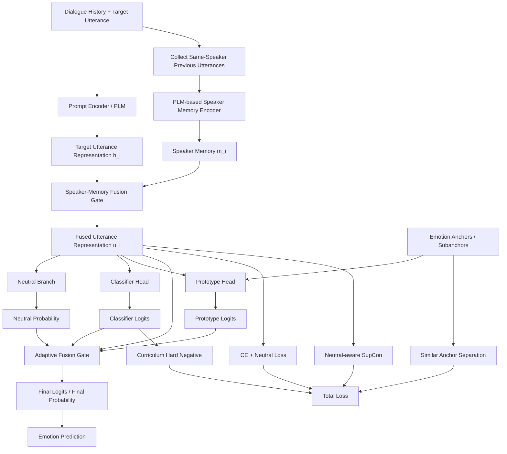

# ERC 模型理论依据改进方案

## 0. 文档定位

本文基于当前 ERC 模型结构进行改进设计。当前模型已经包含：

- PLM prompt encoder；
- emotion semantic anchors / prototypes；
- supervised contrastive learning；
- neutral decoupling；
- speaker state fusion；
- domain-gated subanchors；
- classifier head + prototype head fusion；
- SAS / hard negative / gate entropy 等辅助损失。

整体方向是合理的，但目前结构偏复杂，多个辅助目标同时训练时容易出现 **过拟合、梯度目标冲突、domain gate 塌缩、prototype 更新不稳定** 等问题。因此，本文提出一个更稳、更容易写成论文创新点的改进方案：

> **SMF-EACL：Speaker-Memory and Adaptive-Fusion Emotion-Anchored Contrastive Learning**  
> 中文可称为：**说话人记忆增强的自适应融合情感锚定对比学习模型**。

核心思想是：

1. 用 **speaker memory** 替代弱信息的 speaker_state 字段；
2. 用 **adaptive classifier-prototype fusion** 替代固定 fusion_alpha；
3. 用 **neutral-aware contrastive learning** 继续保留 neutral decoupling；
4. 用 **curriculum hard negative** 替代一开始强开启 hard negative；
5. 用系统消融实验验证每个模块，而不是一次性堆叠所有模块。

---

## 1. 当前模型的主要问题诊断

### 1.1 模块堆叠较多，可能造成目标冲突

当前模型同时使用以下训练目标：

```text
CE
Neutral BCE
SupCon
Angle Loss
SAS
Hard Anchor Negative
Gate Entropy
Prototype Momentum Update
Classifier-Prototype Fusion
```

这些模块单独看都有一定合理性，但同时训练时可能出现冲突。例如：

| 模块 | 主要作用 | 潜在风险 |
|---|---|---|
| SupCon | 同类聚集、异类分离 | 小 batch 下正样本不足 |
| SAS | 拉开相似情感 anchor | 可能过度拉开语义相近类别 |
| Hard Negative | 强化相似负类惩罚 | 容易伤害泛化 |
| Dynamic Prototype Update | 让 anchor 适应数据 | 可能破坏初始语义先验 |
| Domain Gate | 自适应选择子语义域 | 小数据集上容易学到数据偏差 |
| Fusion Alpha | 融合 classifier 与 prototype | 固定 alpha 不够灵活 |

因此，改进方向不是继续增加模块，而是把现有模块重新组织成 **稳定主干 + 少量关键增强模块**。

---

## 2. 理论依据

### 2.1 情感锚点与相似情感分离

Yu et al. (2024) 提出 Emotion-Anchored Contrastive Learning Framework for Emotion Recognition in Conversation，使用 **label encodings as anchors** 引导话语表示学习，并设计辅助损失分离相似情感，例如 happiness / excitement。这与当前模型中的 emotion anchors、SAS、prototype head 直接相关。

**理论启发：**

- emotion label 不只是分类 id，也可以作为语义先验；
- anchor 可以缓解相似情感边界模糊问题；
- anchor 不宜完全静态，也不宜完全自由更新，需要稳定适配。

对应到当前模型：

```text
Emotion anchors / prototypes
+ Similar Anchor Separation
+ Prototype Head
```

是合理的，但 dynamic prototype update 需要更强的稳定约束。

---

### 2.2 监督对比学习与鲁棒情感表示

Khosla et al. (2020) 的 Supervised Contrastive Learning 证明，在监督标签可用时，可以把同类样本作为 positives、不同类样本作为 negatives，使表示空间形成更清晰的类簇结构。Hu et al. (2023) 的 SACL 进一步将监督对比学习用于 ERC，并通过 adversarial samples 和 class-spread contrastive learning 提高上下文鲁棒性。

**理论启发：**

- CE 更关注分类边界；
- SupCon 更关注表示空间结构；
- ERC 中的相似情感需要更细粒度的 class-spread 表示；
- hard negative 是有价值的，但不能一开始过强。

对应到当前模型：

```text
CE + SupCon + SAS + Hard Negative
```

方向是对的，但建议将 hard negative 改为 **curriculum hard negative**。

---

### 2.3 Neutral 类别的特殊性

Kang and Cho (2024) 指出 ERC 数据中 neutral 类别通常占比较高，并且 neutral 具有明显歧义性。如果将 neutral 与其他情感类别完全等同处理，会影响对比学习和分类边界。

**理论启发：**

- neutral 不应简单当作普通情感类别；
- neutral 更接近“无明显情绪”或“情绪弱表达”；
- neutral 与 non-neutral 应该先分开，再做细粒度分类。

对应到当前模型：

```text
Neutral Decoupling
```

应当保留，并进一步把 SupCon 改成 neutral-aware 的版本。

---

### 2.4 说话人建模与上下文依赖

DialogueGCN 使用图结构建模 self-speaker 和 inter-speaker dependency；RGAT 在关系图中加入 sequential information；DAG-ERC 使用 directed acyclic graph 表达对话中的信息流。CoMPM 进一步提出使用 speaker’s pre-trained memory，把同一说话人的历史话语作为说话人记忆，并证明这种方式可以提升上下文建模效果。

**理论启发：**

- ERC 不只是句子分类，而是上下文分类；
- 同一句话在不同说话人状态下可能表达不同情绪；
- speaker dependency 是 ERC 的核心信息；
- 如果原始数据没有结构化 speaker state，不应简单填充 `unknown.`，而应从历史话语中构造 speaker memory。

对应到当前模型：

```text
speaker_state text -> speaker_memory representation
```

这是本文最推荐的结构改进。

---

### 2.5 常识知识与情绪原因

COSMIC 使用 mental states、events、causal relations 等 commonsense knowledge 建模对话中的情绪识别。它说明 ERC 中隐含的心理状态和事件因果关系对情绪判断有帮助。

**理论启发：**

- 情绪通常由事件、意图、心理状态触发；
- speaker memory 可以看作轻量化的隐式常识建模；
- 如果后续有条件，可以用 LLM 或 COMET 生成 emotion cause / intention / mental state 作为额外信息。

本文建议优先采用 **speaker memory**，因为它不依赖外部知识库，更容易稳定复现。

---

## 3. 总体改进方案：SMF-EACL

### 3.1 模型总体结构



---

## 4. 改进一：Speaker Memory 替代弱 Speaker State

### 4.1 问题

当前 speaker state 的字段包括：

```text
mental_state
interaction_relation
expression_style
context_shift
```

如果数据集没有这些字段，则填充为：

```text
unknown.
```

这会导致 speaker state 分支无法提供真实有效信息，甚至可能成为噪声。

### 4.2 改进思路

对每个目标话语 $u_i$，收集同一说话人在历史中最近 $K$ 条话语：

```text
S_i = {u_j | speaker_j = speaker_i, j < i}
```

使用 PLM 编码这些历史话语，得到 speaker memory：

$$
m_i = \text{AttnPool}(\text{PLM}(S_i))
$$

然后与目标话语表示融合：

$$
g_i = \sigma(W_g[h_i;m_i])
$$

$$
\tilde{u}_i = \text{LayerNorm}(h_i + g_i \cdot m_i)
$$

其中：

- $h_i$ 是当前目标话语表示；
- $m_i$ 是同一说话人的历史记忆；
- $g_i$ 是融合门控；
- $\tilde{u}_i$ 是最终话语表示。

### 4.3 理论依据

CoMPM 证明 speaker’s pre-trained memory 可以有效增强 ERC 的上下文建模能力，并且不依赖外部结构化知识。DialogueGCN、RGAT 和 DAG-ERC 也都从不同角度说明 speaker dependency 和上下文结构对 ERC 任务非常重要。

### 4.4 实现建议

新增参数：

```bash
--use_speaker_memory
--speaker_memory_k 3
--speaker_memory_pooling attention
```

建议先设置：

```text
K = 3 或 5
pooling = attention
```

如果数据集对话较短，K 不宜过大。

---

## 5. 改进二：Adaptive Classifier-Prototype Fusion

### 5.1 问题

当前 fusion 使用固定参数：

$$
logits = \alpha \cdot logits_{cls} + (1-\alpha) \cdot logits_{proto}
$$

例如：

```text
fusion_alpha = 0.5
```

这种做法简单稳定，但不足在于：不同样本对 classifier head 和 prototype head 的依赖程度不同。

例如：

| 样本类型 | 更应依赖 |
|---|---|
| 典型情感表达 | prototype head |
| 上下文反转、讽刺、隐含情绪 | classifier head |
| happy / excited 等相似情感 | prototype + anchor separation |
| neutral 边界样本 | neutral branch + classifier head |

### 5.2 改进思路

将固定 alpha 改成样本级动态 alpha：

$$
\alpha_i = \sigma(MLP([\tilde{u}_i; conf_{cls}; conf_{proto}; p_{neutral}]))
$$

最终融合为：

$$
logits_i = \alpha_i \cdot logits_{cls,i} + (1-\alpha_i) \cdot logits_{proto,i}
$$

其中：

```text
conf_cls = max softmax(classifier_logits)
conf_proto = max softmax(prototype_logits)
p_neutral = neutral branch 输出
```

### 5.3 理论依据

EACL 使用 anchors 提供语义先验，并通过 adaptation process 使 anchors 更好地服务分类；但普通 classifier head 仍然具有数据驱动分类优势。因此，adaptive fusion 可以理解为在 **语义先验** 与 **数据驱动分类边界** 之间进行样本级权衡。

### 5.4 实现建议

新增模块：

```python
self.fusion_gate = nn.Sequential(
    nn.Linear(hidden_dim + 3, hidden_dim // 2),
    nn.ReLU(),
    nn.Dropout(dropout),
    nn.Linear(hidden_dim // 2, 1),
    nn.Sigmoid()
)
```

训练时记录：

```text
avg_alpha
alpha_by_class
alpha_correct
alpha_wrong
```

如果模型有效，通常会看到：

- 典型情绪样本更依赖 prototype；
- 复杂上下文样本更依赖 classifier；
- neutral 边界样本 alpha 更偏向 classifier/neutral branch。

---

## 6. 改进三：Neutral-aware Supervised Contrastive Learning

### 6.1 问题

普通 SupCon 会把 neutral 当作普通类别参与同类聚集，但 neutral 的语义不是一个明确情绪中心，而是“无明显情绪”或“弱情绪”。因此，大量 neutral 样本被强行聚成一团，可能会压缩其他类别的表示空间。

### 6.2 改进思路

将 SupCon 分成两部分：

#### 第一层：neutral vs non-neutral

学习 neutral 与 non-neutral 的粗粒度边界：

$$
L_{neu-cl} = SupCon(z_i, y_i^{binary})
$$

其中：

```text
binary label = neutral / non-neutral
```

#### 第二层：non-neutral 内部情感分类

只对非 neutral 样本计算细粒度 SupCon：

$$
L_{emo-cl} = SupCon(z_i, y_i), \quad y_i \neq neutral
$$

最终：

$$
L_{NCL} = \lambda_{neu-cl} L_{neu-cl} + \lambda_{emo-cl} L_{emo-cl}
$$

建议：

```text
lambda_neu_cl = 0.1
lambda_emo_cl = 0.2
```

### 6.3 理论依据

Kang and Cho (2024) 专门指出 ERC 数据中 neutral emotion 具有 predominance 和 ambiguity，并提出针对 ERC 的监督对比学习与 neutral decoupling 思路。因此，neutral-aware SupCon 比普通 SupCon 更符合 ERC 数据分布。

---

## 7. 改进四：Curriculum Hard Negative

### 7.1 问题

当前 hard negative 如果从训练初期就强开启，容易导致以下问题：

- 相似情感被过度推远；
- prototype 空间震荡；
- valid/test 表现不同步；
- 训练集相似情感混淆下降，但测试集泛化变差。

### 7.2 改进思路

将 hard negative 改成课程式训练：

| 阶段 | Epoch | hard negative 强度 |
|---|---:|---:|
| Warm-up | 1–3 | 0 |
| Mild | 4–8 | 0.2 |
| Full | 9+ | 0.5 |

公式：

$$
\rho_t =
\begin{cases}
0, & t \leq 3 \\
0.2, & 3 < t \leq 8 \\
0.5, & t > 8
\end{cases}
$$

Hard negative loss：

$$
L_{hard} = \log \sum_j \exp(w_j s_j) - s_{pos}
$$

其中对相似情感负类设置更高权重：

```text
happy <-> excited
angry <-> frustrated
sad <-> frustrated
```

### 7.3 理论依据

EACL 已经证明相似情感需要额外分离；SACL 说明 hard / adversarial samples 可以提升鲁棒表示。但 ERC 中上下文依赖较强，一开始过度施加 hard negative 可能会破坏基础语义表示。因此，使用 curriculum 策略更稳。

---

## 8. 改进五：Prototype Update 稳定化

### 8.1 问题

当前模型使用 momentum update：

$$
a_c \leftarrow \mu a_c + (1-\mu)\bar{z}_c
$$

这可以让 anchor 适应数据，但也可能破坏初始 label semantic anchor。

### 8.2 改进思路

建议改成三阶段：

| 阶段 | Epoch | 策略 |
|---|---:|---|
| Semantic Warm-up | 1–3 | freeze anchors |
| Slow Adaptation | 4–10 | EMA update, momentum = 0.995 |
| Validation-guarded | 10+ | 如果 valid F1 连续下降，则停止更新 |

### 8.3 实现建议

新增参数：

```bash
--prototype_update_policy validation_guarded
--prototype_stop_update_patience 2
```

当出现：

```text
valid_f1 连续 2 个 epoch 下降
```

则停止 prototype update，只训练 classifier/fusion/head。

---

## 9. 最终损失函数设计

改进后的总损失建议为：

$$
L_{total}
= L_{CE}
+ \lambda_{neu} L_{neutral}
+ \lambda_{ncl} L_{neutral-aware-cl}
+ \lambda_{sas} L_{sas}
+ \lambda_{hard}(t) L_{hard}
+ \lambda_{gate} L_{gate}
$$

其中：

| 损失 | 建议权重 |
|---|---:|
| CE | 1.0 |
| Neutral BCE | 0.2 |
| Neutral-aware SupCon | 0.2 |
| SAS | 0.001–0.003 |
| Curriculum Hard Negative | 0 → 0.2 → 0.5 |
| Gate Entropy | 0.001 |

建议不要同时把 SAS 和 hard negative 权重设得太大。优先尝试：

```text
lambda_sas = 0.002
lambda_hard = curriculum schedule
lambda_gate_entropy = 0.001
```

---

## 10. 推荐训练流程

### 10.1 阶段一：稳定主干

先训练：

```text
PLM prompt encoder
+ classifier head
+ prototype head
+ neutral decoupling
+ fixed fusion alpha
```

目标：确认基础结构稳定。

### 10.2 阶段二：加入 speaker memory

加入：

```text
speaker memory encoder
speaker-memory fusion gate
```

目标：确认说话人历史是否提升 macro-F1，尤其是 IEMOCAP / MELD 中的非 neutral 类别。

### 10.3 阶段三：加入 adaptive fusion

将固定 alpha 替换为：

```text
sample-wise adaptive alpha
```

目标：验证自适应融合是否优于固定 0.3 / 0.5 / 0.7。

### 10.4 阶段四：加入 curriculum hard negative

最后加入：

```text
curriculum hard negative
```

目标：只针对相似情感混淆进行定向优化。

---

## 11. 消融实验设计

### 11.1 主干消融

| 编号 | 设置 | 目的 |
|---|---|---|
| A0 | PLM + CE | 基础分类器 |
| A1 | A0 + SupCon | 验证对比学习 |
| A2 | A1 + Prototype Head | 验证 anchor |
| A3 | A2 + Neutral Decoupling | 验证 neutral 拆分 |
| A4 | A3 + Fixed Fusion | 验证双 head 融合 |
| A5 | A3 + Adaptive Fusion | 验证动态融合 |

### 11.2 Speaker Memory 消融

| 编号 | 设置 | 目的 |
|---|---|---|
| B0 | 无 speaker 信息 | baseline |
| B1 | 原 speaker_state text | 验证原实现 |
| B2 | speaker memory mean pooling | 验证历史记忆 |
| B3 | speaker memory attention pooling | 验证注意力聚合 |
| B4 | speaker memory + adaptive fusion | 验证组合效果 |

### 11.3 相似情感消融

| 编号 | 设置 | 目的 |
|---|---|---|
| C0 | 无 SAS / hard negative | baseline |
| C1 | + SAS | 验证 anchor separation |
| C2 | + Hard Negative | 验证 hard negative |
| C3 | + SAS + Hard Negative | 验证叠加 |
| C4 | + SAS + Curriculum Hard Negative | 验证课程式策略 |

### 11.4 Prototype Update 消融

| 编号 | 设置 | 目的 |
|---|---|---|
| D0 | fixed anchor | 验证静态语义锚点 |
| D1 | momentum update | 验证动态更新 |
| D2 | freeze 3 epochs + momentum | 验证 warm-up |
| D3 | validation-guarded update | 验证稳定更新 |

---

## 12. 重点观察指标

除了 overall F1，建议重点观察：

```text
macro-F1
weighted-F1
neutral-F1
non-neutral macro-F1
happy/excited confusion
angry/frustrated confusion
sad/frustrated confusion
avg_alpha
alpha_by_class
avg_domain_weight
prototype drift
```

其中：

### 12.1 相似情感混淆率

```text
confusion_rate(a -> b) = count(pred=b, gold=a) / count(gold=a)
```

重点看：

```text
happy -> excited
excited -> happy
angry -> frustrated
frustrated -> angry
sad -> frustrated
frustrated -> sad
```

### 12.2 Prototype Drift

衡量训练后 anchor 是否偏离初始语义：

$$
drift_c = 1 - cos(a_c^{init}, a_c^{final})
$$

如果 drift 过大，说明动态更新可能破坏了 label semantic prior。

---

## 13. 预期贡献点写法

可以在论文中概括为三点创新：

### 创新点一：说话人记忆增强

> 针对现有模型中显式 speaker state 字段不足或缺失的问题，本文引入 PLM-based speaker memory，通过聚合同一说话人的历史话语构建动态说话人状态表示，从而增强模型对说话人依赖和情绪延续性的建模能力。

### 创新点二：自适应分类器-原型融合

> 针对固定融合权重难以适应不同样本的问题，本文提出 adaptive classifier-prototype fusion，根据分类头置信度、原型头置信度和 neutral 概率动态调整融合比例，使模型能够在数据驱动分类边界和语义原型先验之间进行样本级权衡。

### 创新点三：面向相似情感的课程式 hard negative

> 针对 ERC 中 happy/excited、angry/frustrated 等相似情感容易混淆的问题，本文在 emotion anchor separation 的基础上引入 curriculum hard negative 策略，先学习稳定的基础表示，再逐步增强相似负类约束，以降低过早强分离带来的过拟合风险。

---

## 14. 推荐最终模型配置

建议最终模型先采用以下配置：

```yaml
use_neutral_decoupling: true
use_speaker_memory: true
speaker_memory_k: 3
speaker_memory_pooling: attention

use_classifier_prototype_fusion: true
fusion_type: adaptive

prototype_pooling: logsumexp 或 domain_gated
prototype_momentum: 0.995
freeze_prototype_epochs: 3
prototype_update_policy: validation_guarded

use_similar_anchor_separation: true
lambda_sas: 0.002

use_hard_anchor_negative: true
hard_negative_schedule: curriculum
hard_negative_rho:
  warmup: 0.0
  mild: 0.2
  full: 0.5

lambda_neu: 0.2
lambda_supcon: 0.2
lambda_gate_entropy: 0.001
batch_size: 16 优先；显存不足时使用梯度累积
```

如果显存不足，优先保证：

```text
effective_batch_size >= 16
```

因为 SupCon 对 batch 内正负样本分布比较敏感。

---

## 15. 实现优先级

| 优先级 | 改进项 | 是否建议马上做 |
|---|---|---|
| P0 | 关闭默认 hard negative，先稳定主干 | 是 |
| P0 | 做完整消融实验表 | 是 |
| P1 | speaker_state 改为 speaker memory | 是 |
| P1 | fixed alpha 改为 adaptive fusion | 是 |
| P2 | neutral-aware SupCon | 建议做 |
| P2 | curriculum hard negative | 建议做 |
| P3 | LLM / commonsense emotion cause | 可作为后续扩展 |
| P3 | 更复杂图结构模块 | 暂不建议，避免模型过重 |

---

## 16. 最终建议

当前模型不建议继续无控制地增加模块。更合理的路线是：

```text
保留 EACL-style anchor 主干
+ 保留 neutral decoupling
+ 用 speaker memory 替换弱 speaker_state
+ 用 adaptive fusion 替换固定 alpha
+ 用 curriculum hard negative 替代直接 hard negative
+ 用消融实验证明每个模块贡献
```

这样模型既有明确理论依据，也更容易写出论文创新点，并且实验结果更容易解释。

---

## 参考文献

1. Yu, F., Guo, J., Wu, Z., & Dai, X. (2024). **Emotion-Anchored Contrastive Learning Framework for Emotion Recognition in Conversation**. Findings of NAACL 2024. https://aclanthology.org/2024.findings-naacl.282/
2. Hu, D., Bao, Y., Wei, L., Zhou, W., & Hu, S. (2023). **Supervised Adversarial Contrastive Learning for Emotion Recognition in Conversations**. ACL 2023. https://aclanthology.org/2023.acl-long.606/
3. Kang, Y., & Cho, Y.-S. (2024). **Improving Contrastive Learning in Emotion Recognition in Conversation via Data Augmentation and Decoupled Neutral Emotion**. EACL 2024. https://aclanthology.org/2024.eacl-long.134/
4. Lee, J., & Lee, W. (2022). **CoMPM: Context Modeling with Speaker’s Pre-trained Memory Tracking for Emotion Recognition in Conversation**. NAACL 2022. https://aclanthology.org/2022.naacl-main.416/
5. Ghosal, D., Majumder, N., Poria, S., Chhaya, N., & Gelbukh, A. (2019). **DialogueGCN: A Graph Convolutional Neural Network for Emotion Recognition in Conversation**. EMNLP-IJCNLP 2019. https://aclanthology.org/D19-1015/
6. Ishiwatari, T., Yasuda, Y., Miyazaki, T., & Goto, J. (2020). **Relation-aware Graph Attention Networks with Relational Position Encodings for Emotion Recognition in Conversations**. EMNLP 2020. https://aclanthology.org/2020.emnlp-main.597/
7. Shen, W., Wu, S., Yang, Y., & Quan, X. (2021). **Directed Acyclic Graph Network for Conversational Emotion Recognition**. ACL-IJCNLP 2021. https://aclanthology.org/2021.acl-long.123/
8. Ghosal, D., Majumder, N., Gelbukh, A., Mihalcea, R., & Poria, S. (2020). **COSMIC: COmmonSense knowledge for eMotion Identification in Conversations**. Findings of EMNLP 2020. https://aclanthology.org/2020.findings-emnlp.224/
9. Khosla, P., Teterwak, P., Wang, C., et al. (2020). **Supervised Contrastive Learning**. NeurIPS 2020. https://arxiv.org/abs/2004.11362
10. Gao, T., Yao, X., & Chen, D. (2021). **SimCSE: Simple Contrastive Learning of Sentence Embeddings**. EMNLP 2021. https://arxiv.org/abs/2104.08821
